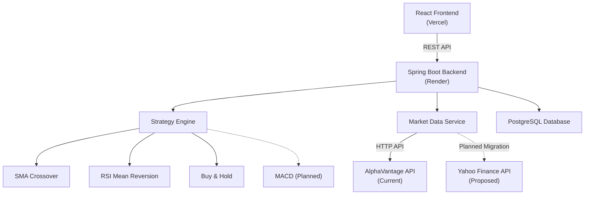
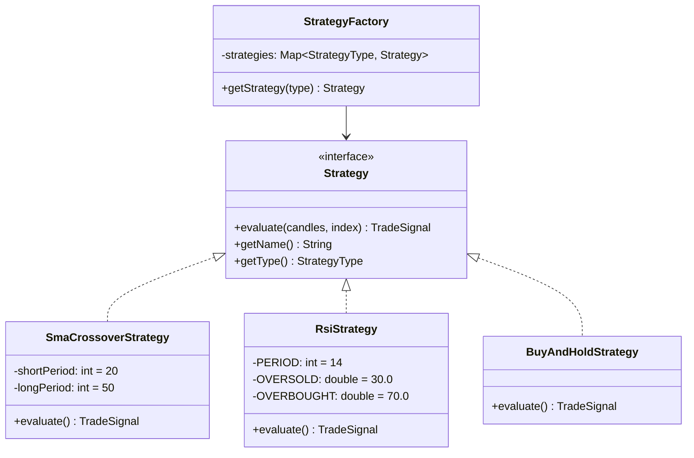
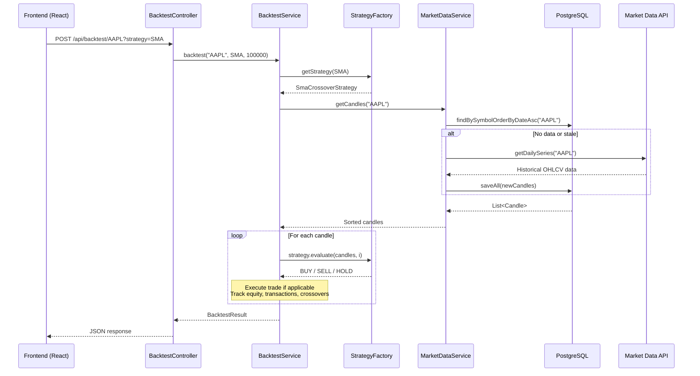

# 📈 Backtesting Strategies Platform — Project Summary

> A full-stack quantitative trading backtesting platform built with **Java 21 + Spring Boot 3.5**, implementing the **Strategy Design Pattern** for extensible trading strategy evaluation against historical market data.

---

## 🏗️ Architecture Overview



---

## 📁 Project Structure

```
BacktestingStrategies/
├── src/main/java/com/rods/backtestingstrategies/
│   ├── BacktestingStrategiesApplication.java    # Spring Boot entry point
│   ├── config/
│   │   └── CorsConfig.java                     # CORS for frontend (Vercel origin)
│   ├── controller/
│   │   ├── BacktestController.java             # POST /api/backtest/{symbol}
│   │   ├── MarketController.java               # GET /api/market/** endpoints
│   │   └── SymbolController.java               # GET /api/symbols/search
│   ├── entity/
│   │   ├── BacktestResult.java                 # Backtest output DTO (Builder pattern)
│   │   ├── Candle.java                         # OHLCV price data entity (JPA)
│   │   ├── CrossOver.java                      # Bullish/Bearish crossover event entity
│   │   ├── CrossOverType.java                  # BULLISH | BEARISH enum
│   │   ├── EquityPoint.java                    # Portfolio snapshot per candle
│   │   ├── SignalType.java                     # BUY | SELL | HOLD enum
│   │   ├── Stock.java                          # Simple stock DTO (symbol + name)
│   │   ├── StockSymbol.java                    # Searchable symbol entity (JPA, indexed)
│   │   ├── TradeSignal.java                    # Signal generated by strategy (JPA)
│   │   └── Transaction.java                   # Executed trade entity (JPA)
│   ├── repository/
│   │   ├── CandleRepository.java              # JPA queries for candle data
│   │   ├── StockSymbolRepo.java               # (Deprecated, fully commented out)
│   │   └── StockSymbolRepository.java         # JPA queries for symbol search
│   ├── service/
│   │   ├── AlphaVantageService.java           # Wrapper for AlphaVantage SDK
│   │   ├── BacktestService.java               # Core backtesting engine
│   │   └── MarketDataService.java             # Data sync, caching, & symbol search
│   └── strategy/
│       ├── BuyAndHoldStrategy.java            # Baseline: buy on day 1, sell on last day
│       ├── RsiStrategy.java                   # RSI(14): buy < 30, sell > 70
│       ├── SmaCrossoverStrategy.java          # SMA(20,50): crossover signals
│       ├── Strategy.java                      # Strategy interface (evaluate + metadata)
│       ├── StrategyFactory.java               # Auto-discovers & maps strategy beans
│       └── StrategyType.java                  # SMA | RSI | MACD | BUY_AND_HOLD
├── src/main/resources/
│   └── application.yml                        # Spring config (env-driven DB + API key)
├── pom.xml                                    # Maven dependencies (Java 21, Spring Boot 3.5)
├── Dockerfile                                 # Multi-stage build (Maven → JRE Alpine)
└── readme.md                                  # Project documentation
```

---

## 🔌 API Endpoints

| Method   | Endpoint                        | Description                                 |
|----------|---------------------------------|---------------------------------------------|
| `GET`    | `/api/market/daily/{symbol}`    | Fetch raw daily series from API             |
| `GET`    | `/api/market/search/{symbol}`   | Search symbols via external API             |
| `GET`    | `/api/market/stocks`            | Get hardcoded stock list (AAPL, MSFT)       |
| `GET`    | `/api/market/stock/{symbol}`    | Fetch & cache candle data (DB-first + sync) |
| `GET`    | `/api/symbols/search?query=`    | Search cached stock symbols                 |
| `POST`   | `/api/backtest/{symbol}`        | Run backtest with strategy + capital params |

### Backtest Endpoint Details

```
POST /api/backtest/AAPL?strategy=SMA&capital=100000
```

Returns:
```json
{
  "startCapital": 100000.0,
  "finalCapital": 112450.0,
  "profitLoss": 12450.0,
  "returnPct": 12.45,
  "equityCurve": [...],
  "transactions": [...],
  "crossovers": [...]
}
```

---

## 🧩 Core Design Patterns

### Strategy Pattern (Central Architecture)



- **`Strategy` interface**: Defines `evaluate(candles, index)` → `TradeSignal`
- **`StrategyFactory`**: Auto-discovers all `@Component` Strategy beans via Spring DI, maps by `StrategyType`
- **Adding a new strategy**: Create a `@Component` implementing `Strategy` — zero changes to existing code (Open/Closed Principle)

### Builder Pattern
- `BacktestResult` uses Lombok `@Builder` for clean immutable construction
- Factory methods on `TradeSignal`, `Transaction`, `CrossOver`, `EquityPoint`

### Repository Pattern
- JPA repositories with custom `@Query` for optimized DB access
- `CandleRepository.findExistingDates()` — efficient date-based sync check
- `StockSymbolRepository.searchSymbols()` — fuzzy search with index support

---

## 📊 Trading Strategies Implemented

### 1. SMA Crossover (20, 50)
- **Logic**: Buy when SMA(20) crosses **above** SMA(50); Sell when crosses **below**
- **Type**: Trend-following strategy
- **Minimum data**: 50 candles before first signal

### 2. RSI Mean Reversion (14)
- **Logic**: Buy when RSI < 30 (oversold); Sell when RSI > 70 (overbought)
- **Type**: Momentum reversal strategy
- **Minimum data**: 14 candles before first signal

### 3. Buy & Hold (Baseline)
- **Logic**: Buy on first candle, sell on last candle
- **Type**: Benchmark strategy for comparison
- **Purpose**: Answers "would simply holding have beaten the active strategy?"

### 4. MACD (Enum exists, not yet implemented)
- `StrategyType.MACD` is declared but has no implementing class

---

## 🗄️ Data Layer

### Entities & Database Tables

| Entity        | Table              | Key Fields                                      | Purpose                     |
|---------------|--------------------|--------------------------------------------------|-----------------------------|
| `Candle`      | `candles`          | symbol, date, OHLCV                             | Historical price data       |
| `StockSymbol` | `stock_symbols`    | symbol, name, type, region, currency            | Searchable symbol catalog   |
| `TradeSignal` | `trade_signals`    | signalDate, signalType, price, strategyName     | Generated trading signals   |
| `CrossOver`   | `crossovers`       | date, type (BULLISH/BEARISH), price             | Crossover events            |
| `EquityPoint` | `equity_points`    | date, price, equity, shares, cash               | Equity curve snapshots      |
| `Transaction` | `transactions`     | date, type (BUY/SELL), price, shares, cash/equity after | Trade execution log   |

### Data Optimization Strategies
1. **Local Persistence**: Candle data cached in PostgreSQL after first fetch
2. **Time-based Sync**: API called only when data is missing or outdated
3. **Existing-date Check**: `findExistingDates()` query prevents duplicate fetches
4. **Symbol Caching**: 7-day cache window on symbol search results
5. **Bulk Insert**: `saveAll()` instead of individual saves for new candles

---

## ⚙️ Tech Stack

| Layer        | Technology                                           |
|--------------|------------------------------------------------------|
| Language     | Java 21                                              |
| Framework    | Spring Boot 3.5.7                                    |
| ORM          | Spring Data JPA / Hibernate                          |
| Database     | PostgreSQL (production), MySQL (local dev commented) |
| Market Data  | AlphaVantage API (`alphavantage-java:1.8.0`)         |
| Build        | Maven                                                |
| Code Gen     | Lombok (`@Data`, `@Builder`, `@RequiredArgsConstructor`) |
| Container    | Docker (multi-stage: Maven build → JRE Alpine)       |
| Frontend     | React (separate repo, deployed on Vercel)            |
| Backend Host | Render                                               |

---

## 🚨 Current Issues & Limitations

1. **AlphaVantage Rate Limits**: Free tier = 5 calls/minute, 500/day — severely limits development and demo
2. **MACD Strategy**: Enum declared but no implementation exists
3. **Hardcoded Strategy Parameters**: SMA periods (20/50), RSI period (14) are class constants, not configurable
4. **No Advanced Metrics**: Missing Sharpe Ratio, Max Drawdown, Win Rate — only basic PnL
5. **No Strategy Comparison**: Can only run one strategy at a time
6. **Hardcoded Stock List**: `/api/market/stocks` returns only AAPL & MSFT
7. **Deprecated Code**: `StockSymbolRepo.java` is fully commented out but still in the codebase
8. **`Stock.java` JPA Issue**: Uses `@Id @GeneratedValue` on a `String` field without being an `@Entity`
9. **Mixed DI Patterns**: Some services use `@Autowired` field injection, others use constructor injection
10. **CORS**: Hardcoded to single Vercel URL — no environment variable support

---

## 🔮 Planned Migration: AlphaVantage → Yahoo Finance

### Why Migrate
| Aspect        | AlphaVantage (Current)        | Yahoo Finance (Proposed)           |
|---------------|-------------------------------|------------------------------------|
| API Key       | Required                      | Not required                       |
| Rate Limit    | 5/min, 500/day (free)         | No enforced limits                 |
| Library       | JitPack dependency            | Maven Central                      |
| Data Quality  | Good                          | Good                               |
| Symbol Search | Dedicated search API          | No search API (DB-based fallback)  |
| Extra Data    | Limited in free tier          | Quotes, stats, dividends included  |

### Migration Scope
- **Remove**: `AlphaVantageService.java`, JitPack repo, API key config
- **Add**: `YahooFinanceService.java` wrapping `com.yahoofinance-api:YahooFinanceAPI:3.17.0`
- **Update**: `MarketDataService.java` to map `HistoricalQuote` → `Candle`
- **Update**: Controllers to remove AlphaVantage direct references

---

## 💡 Proposed Standout Features

### 1. MACD Strategy
Complete the unimplemented MACD strategy using standard MACD(12, 26, 9) parameters with signal line crossover.

### 2. Advanced Performance Metrics
Add Sharpe Ratio, Maximum Drawdown, Win Rate, Average Win/Loss ratio, total trade count, and annualized return to `BacktestResult`.

### 3. Strategy Comparison API
New endpoint to run all strategies on the same data simultaneously and return a side-by-side comparison.

### 4. Portfolio-Level Backtesting
Accept a basket of stocks with weights, run strategy across all, and return aggregate portfolio metrics.

### 5. Configurable Strategy Parameters
Allow strategy parameters (SMA periods, RSI thresholds) to be passed via REST query params instead of being hardcoded.

### 6. Real-Time Quote Endpoint
Expose live price, 52W high/low, market cap, P/E, EPS, and dividend yield via Yahoo Finance's quote data.

---

## 📦 Dependencies

```xml
<!-- Current Dependencies -->
spring-boot-starter-data-jpa    <!-- JPA/Hibernate ORM -->
spring-boot-starter-web         <!-- REST API framework -->
spring-boot-starter-test        <!-- Testing -->
lombok                          <!-- Code generation -->
mysql-connector-j               <!-- MySQL (local dev) -->
postgresql                      <!-- PostgreSQL (production) -->
alphavantage-java:1.8.0         <!-- AlphaVantage SDK (TO BE REMOVED) -->

<!-- Proposed Addition -->
YahooFinanceAPI:3.17.0          <!-- Yahoo Finance SDK -->
```

---

## 🐳 Deployment

```
┌─────────────────────────────────────────────────┐
│  Docker Multi-Stage Build                       │
│                                                 │
│  Stage 1: maven:3.9.6-eclipse-temurin-21        │
│    • mvn dependency:go-offline                  │
│    • mvn clean package -DskipTests              │
│                                                 │
│  Stage 2: eclipse-temurin:21-jre-alpine         │
│    • COPY target/*.jar app.jar                  │
│    • EXPOSE 8080                                │
│    • java -jar app.jar                          │
└─────────────────────────────────────────────────┘
```

| Environment Variable     | Purpose                       |
|--------------------------|-------------------------------|
| `DB_URL`                 | PostgreSQL connection string  |
| `DB_USERNAME`            | Database username             |
| `DB_PASSWORD`            | Database password             |
| `ALPHAVANTAGE_API_KEY`   | API key (to be removed)       |
| `JPA_DDL_AUTO`           | Hibernate DDL mode (default: update) |
| `JPA_SHOW_SQL`           | Show SQL logging (default: true) |

---

## 🧠 Execution Flow



---

*Generated on 2026-03-28 | Backtesting Strategies v0.0.1-SNAPSHOT*
