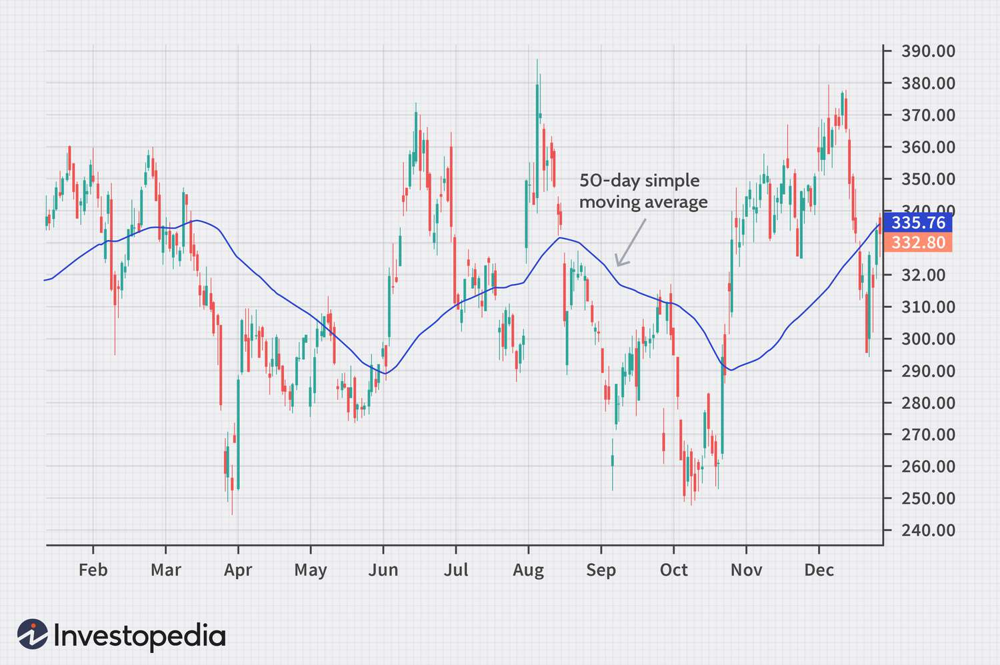
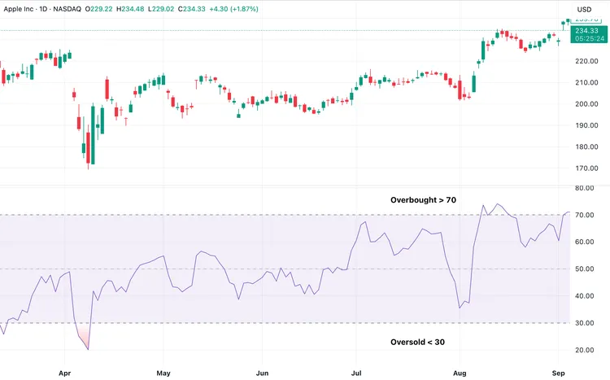
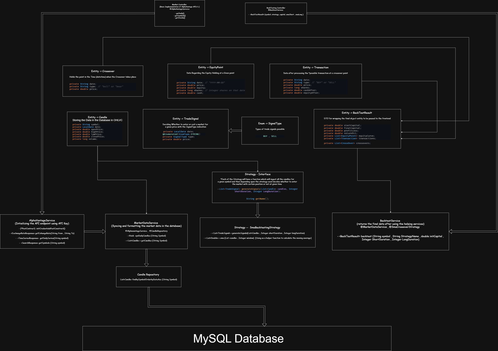

# 📈 SMA Trading & Backtesting Platform

A **full-stack quantitative trading backtesting platform** that currently supports **Simple Moving Average (SMA)** and **Relative Strength Index (RSI)** strategies.
The system is designed with **clean architecture**, **strategy-based extensibility**, and **scalability** as first-class concerns.

The application is deployed with:

* **Frontend** on **Vercel**
* **Backend** on **Render**
* **Database** using **PostgreSQL**

---

## 🌐 Live Deployment

| Layer       | Platform   |
| ----------- | ---------- |
| Frontend    | Vercel     |
| Backend API | Render     |
| Database    | PostgreSQL |

---

## 🧠 What is Backtesting?

**Backtesting** is the process of **evaluating a trading strategy using historical market data** to determine how it would have performed in the past.

### Why Backtesting Matters

* Validates a strategy **before risking real money**
* Helps identify **strengths, weaknesses, and drawdowns**
* Enables **objective comparison** between strategies

### Example

Assume a strategy:

> Buy when SMA(20) crosses above SMA(50)
> Sell when SMA(20) crosses below SMA(50)

Using historical price data:

* The system simulates every buy/sell signal
* Tracks profits, losses, and overall returns
* Produces performance metrics

📌 **Important**:

> Past performance does NOT guarantee future results — but backtesting is essential for strategy validation.

---

## 📊 Trading Indicators Implemented

### 1️⃣ Simple Moving Average (SMA)

**SMA** smooths price data by calculating the average price over a fixed number of periods.



#### Formula

```
SMA = (Sum of prices over N periods) / N
```

#### Example

* SMA(20): Average of last 20 days
* SMA(50): Average of last 50 days

#### Strategy Logic

* **Buy** → Short-term SMA crosses above long-term SMA
* **Sell** → Short-term SMA crosses below long-term SMA

Used to:

* Identify trends
* Reduce market noise

---

### 2️⃣ Relative Strength Index (RSI)

**RSI** is a momentum oscillator that measures the **speed and magnitude of price movements**.



#### RSI Range

* `0 – 100`

#### Common Interpretation

| RSI Value | Meaning    |
| --------- | ---------- |
| > 70      | Overbought |
| < 30      | Oversold   |

#### Strategy Logic

* **Buy** → RSI < 30 (oversold)
* **Sell** → RSI > 70 (overbought)

Used to:

* Identify potential reversals
* Detect overbought/oversold conditions

---

## 🏗️ System Architecture Overview

```
Frontend (React)
    |
    | REST API Calls
    v
Backend (Spring Boot)
    |
    | Strategy Engine
    | Indicator Calculations
    v
PostgreSQL Database
```

---

## ⚙️ Tech Stack

### 🖥️ Frontend [AI-assisted UI development (Antigravity, ChatGPT)]

* React
* JavaScript / TypeScript
* REST-based API integration
* Deployed on **Vercel**

### ⚙️ Backend

* Java
* Spring Boot
* Strategy Design Pattern
* REST APIs
* JPA / Hibernate
* PostgreSQL
* Deployed on **Render**

### 🗄️ Database

* PostgreSQL
* Stores:

  * Market data
  * Backtest results
  * Strategy execution logs

---

## 🔌 Market Data Integration

The system uses the **Alpha Vantage API** to fetch historical stock price data.

### Challenges with External APIs

* Rate limits
* High latency
* Redundant calls for same symbols

---

## 🚀 API Optimization Strategies Implemented

To **reduce API calls and improve performance**, the system uses:

### ✅ 1. Local Persistence

* Fetched market data is stored in PostgreSQL
* Same data is reused for future backtests

### ✅ 2. Time-based Fetching

* API is called only if:

  * Data is missing
  * Data is outdated

### ✅ 3. Strategy-Level Reuse

* Multiple strategies reuse the **same price dataset**
* Indicators are calculated **in-memory** on shared data

📉 Result:

* Lower latency
* Reduced API quota usage
* Better scalability

---

## 🧩 Strategy Design Pattern (Core Architecture)

### Why Strategy Pattern?

Trading systems naturally evolve:

* New indicators
* New strategies
* New execution logic

Hardcoding logic would lead to:
❌ Tight coupling
❌ Code duplication
❌ Difficult scaling

---

### Strategy Interface (Conceptual)

```java
public interface TradingStrategy {
    TradeSignal evaluate(List<CandleData> data);
}
```

### Concrete Implementations

* `SMAStrategy`
* `RSIStrategy`

### Benefits

✔️ Open/Closed Principle
✔️ Easy to add new strategies
✔️ No impact on existing code
✔️ Clean separation of concerns

---

## 🧠 Mental Model of Execution

1. User selects:

   * Stock symbol
   * Strategy (SMA / RSI)
2. Backend:

   * Fetches historical data (DB or API)
   * Applies selected strategy
   * Simulates trades
3. Results:

   * Profit/Loss
   * Trade history
   * Indicator values
4. Frontend:

   * Displays charts and metrics

---

## 🔮 Future Roadmap

### 🚀 Planned Enhancements

#### 🔐 User Accounts & Personalization

* Login / Registration
* Save:

  * Preferred strategies
  * Risk parameters
  * Watchlists

#### ⚡ Redis Integration

* Cache market data
* Cache backtest results
* Reduce DB and API load

#### 📈 More Strategies

* EMA
* MACD
* Bollinger Bands
* VWAP
* Multi-indicator hybrid strategies

#### 📊 Advanced Metrics

* Sharpe Ratio
* Maximum Drawdown
* Win/Loss Ratio

---

## 🏁 Summary

This project demonstrates:

* Real-world backend architecture
* Clean design patterns
* Financial domain understanding
* Scalable and extensible system design

It is intentionally built as a **foundation** that can evolve into a **full-scale quantitative trading and analysis platform**.

---


I love Finance and Economics -> building side project implementing different trading strategies on market data 
I am exploring java and have built the entire backend on java using springboot 

